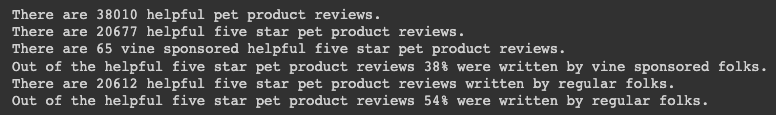

# Amazon_Vine_Analysis

## Overview 
Analyze Amazon reviews on pet products written by customers. Some of them are also written by members of the paid Amazon Vine program. To complete the project used pyspark on google co-lab and then I connected to an AWS RDS instance to load the transformed data into SQL tables using PgAdmin. I then returned to google co-lab to proforma further analysis on the dataset.

### Resources

Software:
- Visual Studio Code (Version: 1.76.2)
- Google CoLab
- pgAdmin4/Postgres
- Amazon Web Services 

Languages: PySpark, SQL
    
Data: Pet Products via Amazon https://s3.amazonaws.com/amazon-reviews-pds/tsv/amazon_reviews_us_Pet_Products_v1_00.tsv.gz 

Starter Code: [code/Starter_Code](code/Starter_Code)

## Results: 

### Code

- ETL [code/Amazon_Reviews_ETL.ipynb](code/Amazon_Reviews_ETL.ipynb)
- Schema: [code/schema.sql](code/schema.sql)
- Review Analysis: [code/Vine_Review_Analysis.ipynb](code/Vine_Review_Analysis.ipynb)

### Major Findings 

- There was a total of 2,643,619 reviews to analyze.
    - Out of all the pet product reviews, there are 1,645,553 five-star reviews of which 4,343 are vine sponsored.
    - Out of all the vine sponsored pet product reviews, 43% of them had a five-star rating.
    - Out of all the regular pet product reviews, there are 1,641,210 or 62% five-star reviews.

- I narrowed down the list to just the helpful reviews, 38,010, with a few criteria. They include a total vote count of at least 20 and where more than half of them have been tagged as helpful. 
    - There are 20,677 helpful five-star pet product reviews and 65 vine sponsored helpful five-star pet product reviews.
    - Out of the helpful five-star pet product reviews 38% were written by vine sponsored folks 54% were written by regular folks.

### Summary

In your summary, state if there is any positivity bias for reviews in the Vine program. Use the results of your analysis to support your statement. Then, provide one additional analysis that you could do with the dataset to support your statement.

The data shows that there are more five-star reviews written by regular folks. If I were to preform additional analysis, I would further filter the helpful reviews to exclude the non-verified purchases. 

### Images 

#### Amazon Review ETL 
##### Load All Data

##### Customer 

##### Products 

##### Review

##### Vine

#### Vine Review Analysis 
Data Frame

##### Helpful Reviews

##### Sponsored Helpful Reviews

##### Non-sponsored Helpful Reviews

#### Totals 

##### Helpful Totals

